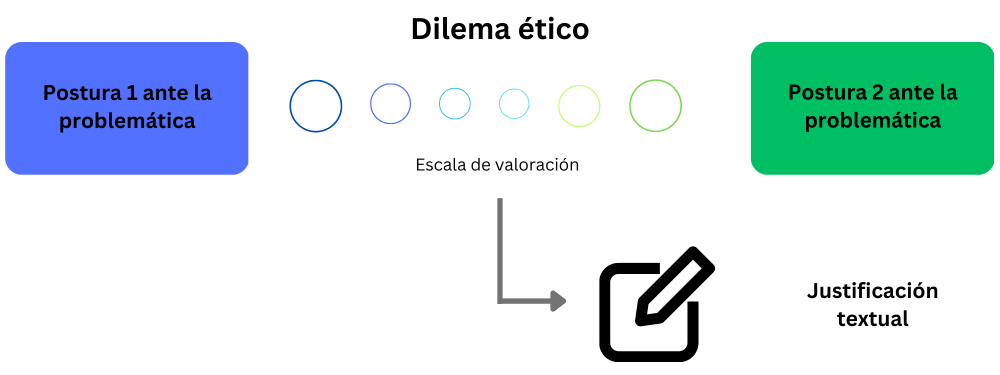
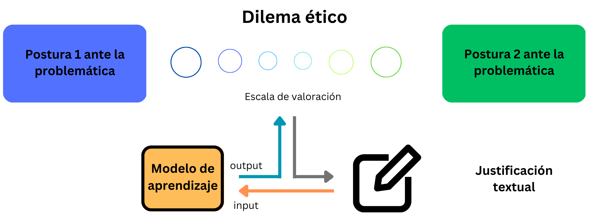

# Procesamiento de datos textuales EthicApp con algoritmos de procesamiento de lenguaje natural

Autor: Camilo Carvajal Reyes

Equipo de Trabajo Unidad de Ética FCFM, UChile: Josefa Cerda, Pablo Ramírez y Eduardo Hurtado

## Resumen

La aplicaión EthicApp es una herramienta que permite recolectar preferencias de estudiantes ante dilemas éticos y sus justificaciones.

Lamentablemente, el gran volumen de datos (del orden de dos mil textos) dificulta el análisis de estos. Este trabajo aborda el uso de modelos de aprendizaje de máquina supervisados y no-supervisados para modelar la estructura textual de las respuestas y con esto apoyar el análisis que puedan hacer los equipos docentes.

Pese al potencial de mejora, la metodología propuesta ofrece una visión general de las respuestas y conceptos utilizados, lo que permitirá tomar decisiones informadas y justificadas para evaluar las competencias en éticas de estudiantes de la FCFM.

## Contenidos
Se muestran los Notebooks para los modelos relevantes para el caso Adela.
- [Exploración de datos](exploracion-datos/exploracion_caso_adela.ipynb)
- [Modelo de clasificación Naive-Bayes](naive-bayes/NB_adela.ipynb)
- [Modelo de tópicos LDA](topic-modelling/TM_adela.ipynb)
- [Modelo de tópicos BERTopic](topic-modelling/BT_adela.ipynb)
